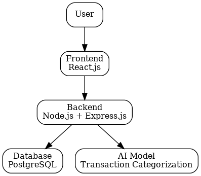
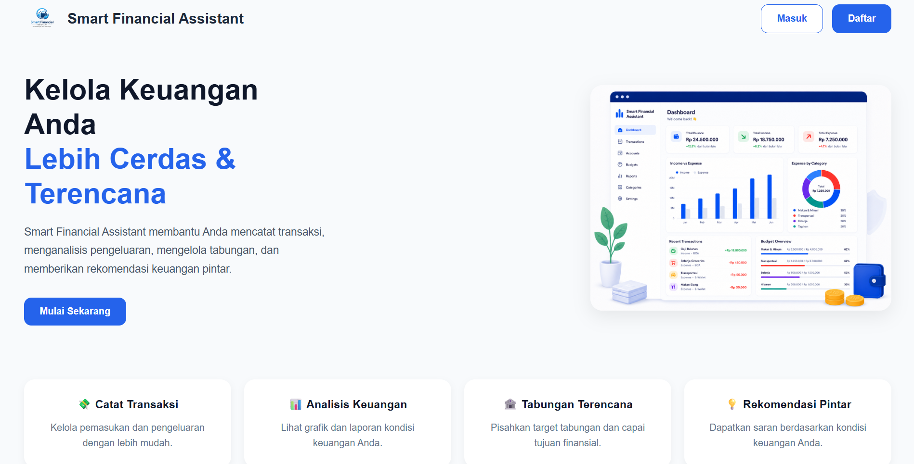
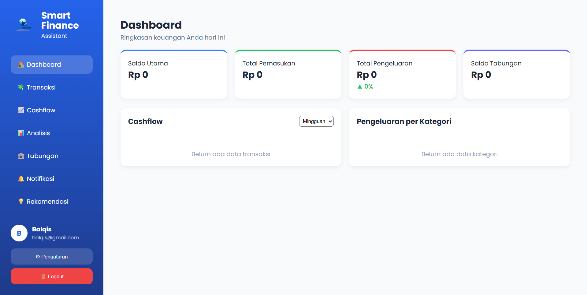
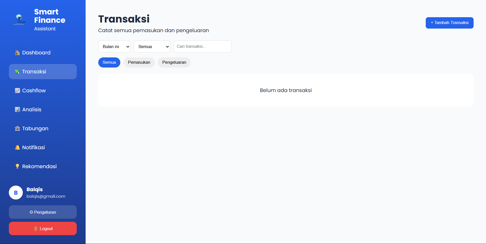
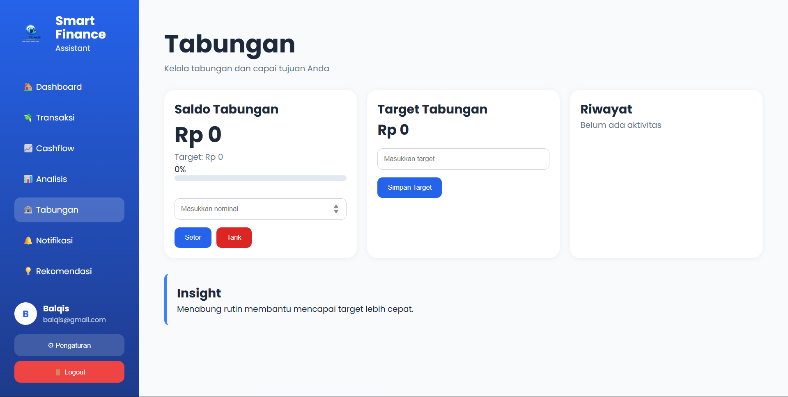
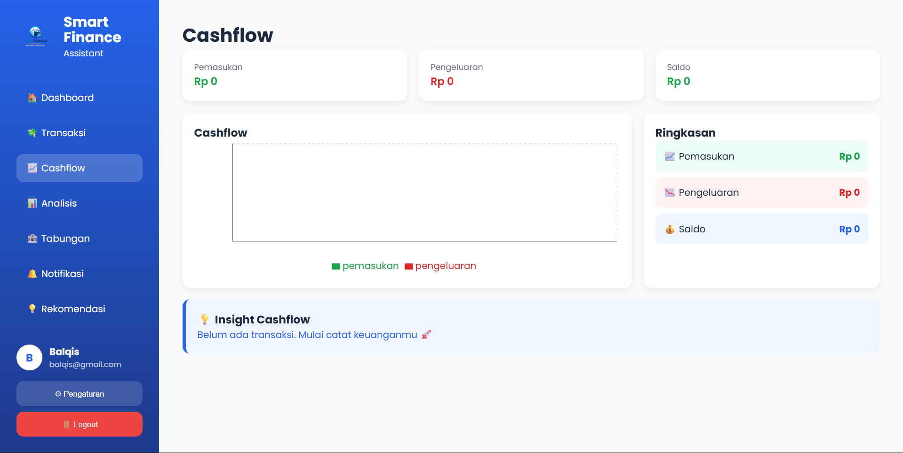
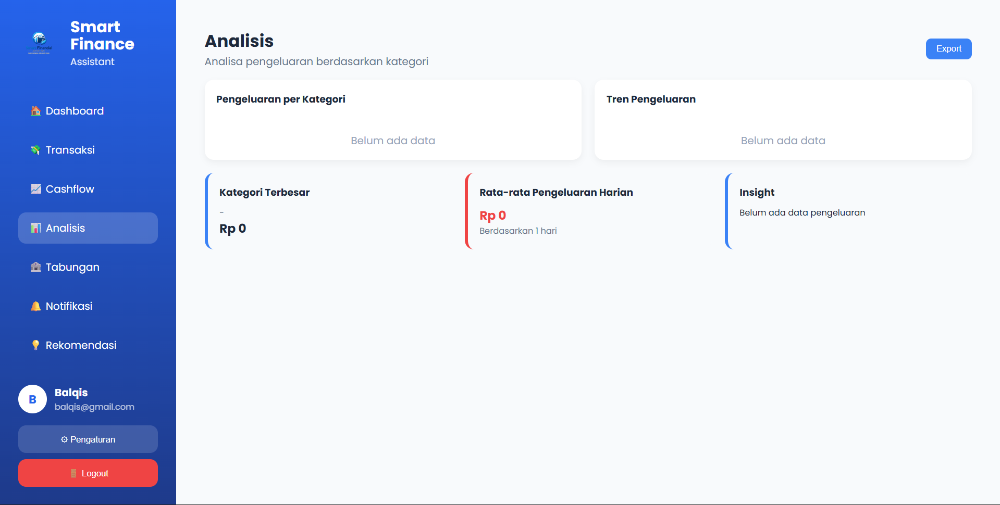
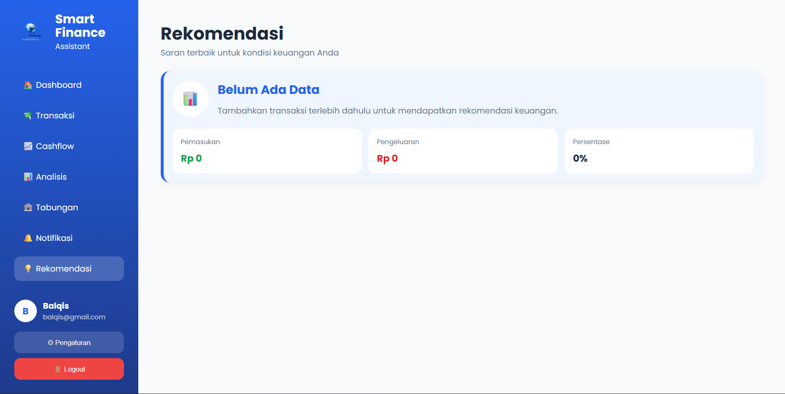
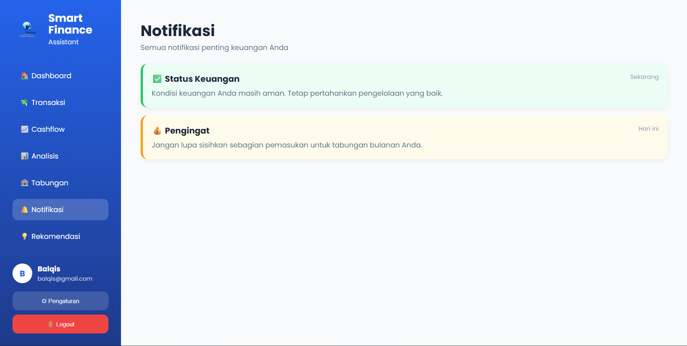
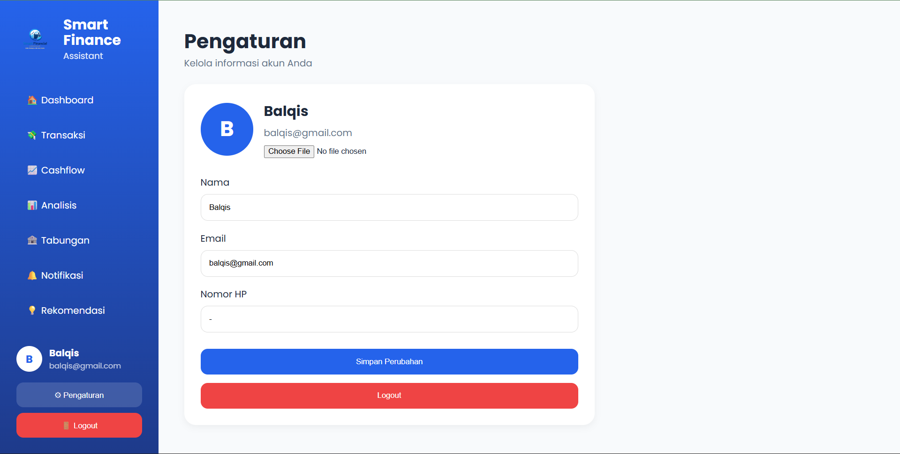

# Smart Financial Assistant

Smart Financial Assistant adalah aplikasi pengelolaan keuangan pribadi berbasis web yang membantu pengguna mencatat pemasukan dan pengeluaran, memantau kondisi keuangan, mengelola target tabungan, serta melakukan kategorisasi transaksi secara otomatis menggunakan Artificial Intelligence (AI).

---

## Features

* User Authentication (Login & Register)
* Financial Dashboard
* Transaction Management
* Cashflow Monitoring
* Savings Target Management
* Financial Notifications
* Financial Recommendations
* AI-Based Transaction Categorization
* User Profile Management

---

## System Architecture

User berinteraksi melalui aplikasi Frontend React.js yang terhubung ke Backend Node.js + Express.js. Backend mengelola data pada PostgreSQL dan berkomunikasi dengan AI Service berbasis Flask + TensorFlow untuk melakukan kategorisasi transaksi secara otomatis.

### Architecture Diagram



---

## Application Screenshots

### Home Page



### Dashboard



### Transaction Management



### Savings Management



### Cashflow Monitoring



### Financial Analysis



### Financial Recommendation



### Notification Center



### User Profile



---

## Technology Stack

### Frontend

* React.js
* Axios
* Vite

### Backend

* Node.js
* Express.js
* JWT Authentication

### Database

* PostgreSQL

### Artificial Intelligence

* Python
* Flask
* TensorFlow
* Keras

---

## Project Structure

```text
capstone-project/
│
├── frontend/
│   ├── src/
│   ├── public/
│   └── package.json
│
├── backend/
│   ├── src/
│   ├── ai-service/
│   │   ├── app.py
│   │   └── model_final.keras
│   └── package.json
│
├── screenshots/
│
├── README.md
└── .gitignore
```

---

## Installation

### 1. Clone Repository

```bash
git clone https://github.com/Rohbaik10/capstone-project.git
```

### 2. Install Frontend Dependencies

```bash
cd frontend
npm install
```

### 3. Install Backend Dependencies

```bash
cd ../backend
npm install
```

### 4. Configure Environment Variables

Buat file `.env` pada backend dan sesuaikan konfigurasi PostgreSQL serta kebutuhan aplikasi.

Contoh:

```env
DB_HOST=localhost
DB_PORT=5432
DB_USER=postgres
DB_PASSWORD=your_password
DB_NAME=smart_financial
JWT_SECRET=your_secret_key
```

---

## Running the Application

### Run AI Service

```bash
cd backend/ai-service
python app.py
```

AI Service akan berjalan pada:

```text
http://localhost:5001
```

### Run Backend Server

```bash
cd backend
npm run dev
```

Backend akan berjalan pada:

```text
http://localhost:5000
```

### Run Frontend

```bash
cd frontend
npm run dev
```

Frontend akan berjalan pada:

```text
http://localhost:5173
```

---

## Artificial Intelligence Integration

Fitur AI digunakan untuk melakukan kategorisasi transaksi secara otomatis berdasarkan deskripsi transaksi yang dimasukkan pengguna.

Contoh:

| Input Transaksi  | Hasil Kategori |
| ---------------- | -------------- |
| beli nasi goreng | makanan        |
| bayar listrik    | tagihan        |
| isi bensin       | transportasi   |
| topup dana       | topup          |
| beli kopi        | minuman        |

Alur proses:

```text
User Input
    ↓
Frontend React
    ↓
Backend Express
    ↓
AI Service Flask
    ↓
TensorFlow Model
    ↓
Predicted Category
    ↓
PostgreSQL Database
```

---

## Team

**CC26-PSU189**

Coding Camp 2026 Capstone Project

---

## Version

Current Release: **v1.0**

---

## License

This project was developed for educational purposes as part of the Coding Camp 2026 Capstone Project.
